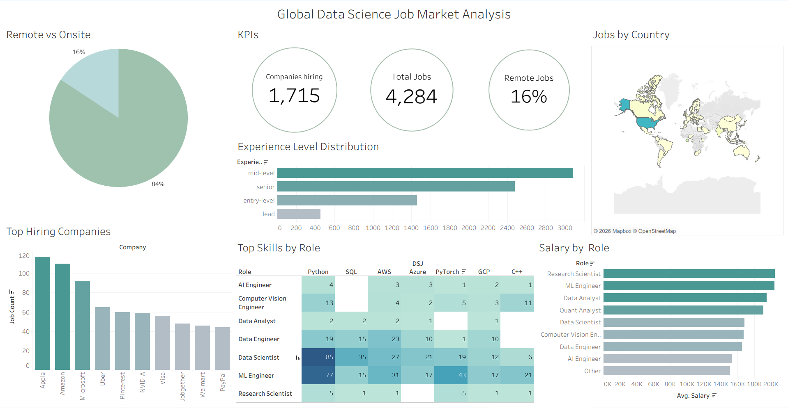
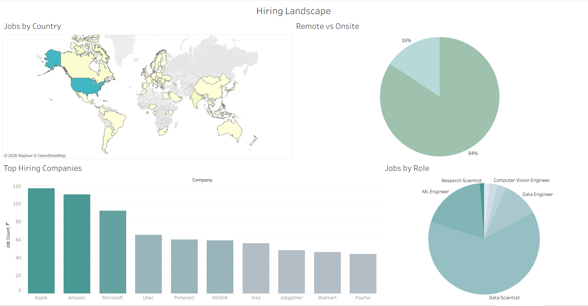
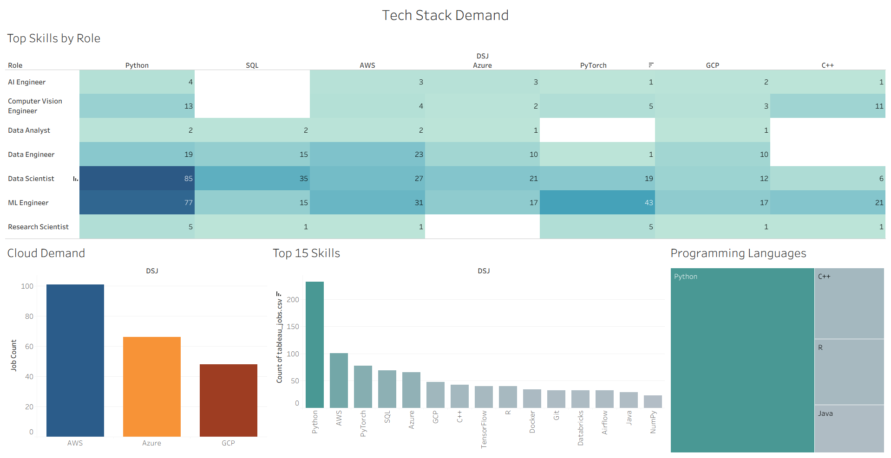

# Global Data Science Job Market Analysis

## Problem Statement

As a data science student navigating an increasingly competitive job market, I wanted to answer 
a simple question: *what does the market actually want?* Rather than relying on anecdotal advice, 
I built an end-to-end data pipeline to collect, enrich, and analyze thousands of real job postings 
from datasciencejobs.com and remoteok.com.

The pipeline scrapes job listings using Selenium, cleans and transforms the raw data with Pandas, 
and uses the OpenAI API to infer experience levels and education requirements at scale. The results 
are visualized across three interactive Tableau dashboards covering hiring trends, skill demand, 
and salary distributions.

Key questions this project answers:
- Which companies are hiring the most data professionals right now?
- What skills are actually required and do they differ by role?
- How does salary vary across Data Scientist, ML Engineer, and Data Engineer positions?
- Is remote work still common in data science, or is the market pulling back to onsite?
- What experience level does the market demand, and how hard is it to break in as a new grad?
---

## Data Sources
[datasciencejobs.com](https://datasciencejobs.com/)

[remoteok.com](https://remoteok.com/)

---
## Dashboards

### Global Data Science Job Market Analysis



This dashboard provides a high-level overview of the global data science job market.

Key views include:
- Remote vs onsite job distribution
- Total jobs, companies hiring, and remote job share
- Global job distribution by country
- Experience level demand
- Top hiring companies
- Skill demand by role
- Average salary by role

Key Finidings: 
- **4,284 jobs** were collected across **1,715 unique companies** the market is highly fragmented with no single employer dominating hiring
- **37% of postings are remote** significantly above the historical pre-pandemic average, reflecting a sustained shift in data science hiring norms
- **Mid-level roles dominate** at 2,500+ postings, followed closely by senior at ~2,400 entry-level and lead roles make up a small minority, signaling a market that rewards prior experience
- **Research Scientists and ML Engineers command the highest salaries**, both averaging above $160K, while Data Engineers and AI Engineers trail slightly behind

### Hiring Landscape


This dashboard focuses on company hiring behavior and job distribution.

Key views include:

- Global distribution of jobs by country
- Remote vs onsite job ratio
- Top hiring companies
- Distribution of jobs by role

Key Finidings: 
- **The United States accounts for the overwhelming majority of postings** the map shows a stark concentration in North America, with Europe a distant second
- **Apple, Amazon, and Microsoft are the top 3 hiring companies** with 118, 111, and 93 postings respectively. Big Tech remains the dominant employer of data professionals
- **Data Scientist is the most posted role by volume**, accounting for the largest share of the jobs-by-role breakdown, ahead of ML Engineer and Data Engineer
- **78.69% of jobs are onsite** despite remote work being common in tech broadly, most data science roles still require physical presence


### Tech Stack Demand



This dashboard analyzes the technologies and tools most requested in data science job postings.

Key views include:
- Skill demand by role
- Top 15 most requested technologies
- Cloud platform demand (AWS, Azure, GCP)
- Programming language demand

Key Finidings: 
- **Python is the undisputed #1 skill** with 230+ mentions across all roles, no other skill comes close, appearing across every role from Data Analyst to Research Scientist
- **AWS leads cloud platforms** with 100+ mentions, nearly 1.5x Azure (65) and over 2x GCP (47) cloud skills are non-negotiable for Data and ML Engineers
- **PyTorch dominates ML frameworks** with 43 mentions in ML Engineer postings alone, outpacing TensorFlow — the industry has converged on PyTorch for deep learning work
- **C++ is uniquely critical for Computer Vision Engineers** (11 mentions), the only role where a systems language ranks in the top skills, reflecting real-time inference requirements

---
## Live Dashboards
 
| Dashboard | Description |
|-----------|-------------|
| [Global Overview](https://public.tableau.com/app/profile/wasef.chowdhury/viz/GlobalDataScienceJobMarketAnalysis/GlobalDataScienceJobMarketAnalysis) | High-level market overview — remote share, salary by role, experience demand |
| [Hiring Landscape](https://public.tableau.com/app/profile/wasef.chowdhury/viz/GlobalDataScienceJobMarketAnalysis/HiringLandscape) | Company hiring behavior, job distribution by country and role |
| [Tech Stack Demand](https://public.tableau.com/app/profile/wasef.chowdhury/viz/GlobalDataScienceJobMarketAnalysis/TechStackDemand) | Skill demand by role, top technologies, cloud and language trends |
 
 ---
## Tech Stack
 
| Layer | Tools |
|-------|-------|
| Scraping | Python, Selenium, SeleniumBase |
| Data Processing | Pandas, NumPy |
| LLM Enrichment | OpenAI API (gpt-4o-mini) |
| Visualization | Tableau Public, Matplotlib, Seaborn |
| Environment | python-dotenv, tqdm |
 
---
## Getting Started
 
### 1. Clone the repository
 
```bash
git clone https://github.com/wrezachow/global-data-science-job-analysis.git
cd global-data-science-job-analysis
```
 
### 2. Create and activate a virtual environment
 
```bash
python -m venv venv
```
 
**Windows:**
```bash
venv\Scripts\activate
```
 
**Mac / Linux:**
```bash
source venv/bin/activate
```
 
### 3. Install dependencies
 
```bash
pip install -r requirements.txt
```
 
### 4. Configure environment variables
 
Create a `.env` file in the project root:
 
```
OPENAI_API_KEY=your_api_key_here
```
 
---
 
## Running the Pipeline
 
### Step 1 — Scrape job postings
 
```bash
python main.py
```
 
Outputs: `data/raw/scraped_jobs_raw.csv`
 
### Step 2 — Clean and transform the data
 
Open and run all cells in:
 
```
1_data_transform.ipynb
```
 
Handles null values, salary parsing, work mode derivation, deduplication, and skills normalization.

Outputs: `data/clean/clean_jobs.csv`
 
### Step 3 — LLM enrichment
 
Open and run all cells in:
 
```
2_llm_parse.ipynb
```
 
Uses `gpt-4o-mini` to infer `experience_level` and `education` from job title and skills for all rows.
 
Outputs: `data/clean/filled_jobs.csv`

### Step 4 - EDA

Open and run all cells in:

```
3_EDA.ipynb
```
 Explores skill frequency, salary distributions, experience level breakdowns, and remote vs onsite trends. Findings feed directly into the Tableau dashboards.

 Outputs: `data/clean/tableau_jobs.csv`

---
 
## Dataset Schema
 
| Field | Description |
|-------|-------------|
| `title` | Job title |
| `company` | Hiring company |
| `location` | Job location |
| `work_mode` | `remote` or `onsite` — derived from location |
| `job_type` | `full-time`, `contract`, etc. |
| `skills` | List of required skills |
| `salary_min` | Minimum salary (USD) |
| `salary_max` | Maximum salary (USD) |
| `salary_avg` | Average of min and max |
| `date_posted` | Posting date |
| `experience_level` | `entry-level`, `mid-level`, `senior`, `lead` — LLM inferred |
| `education` | Degree requirement — LLM inferred |
| `source` | Source job board |
| `job_url` | Direct link to posting |
 
---
 

